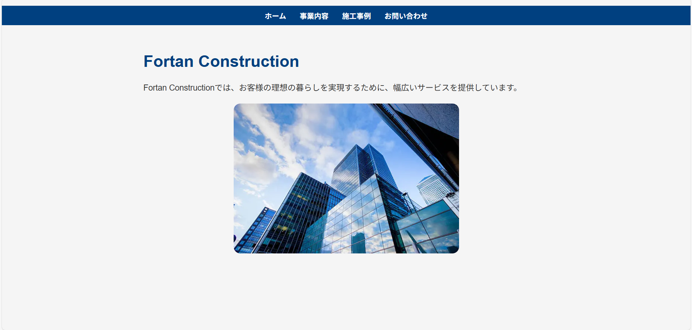
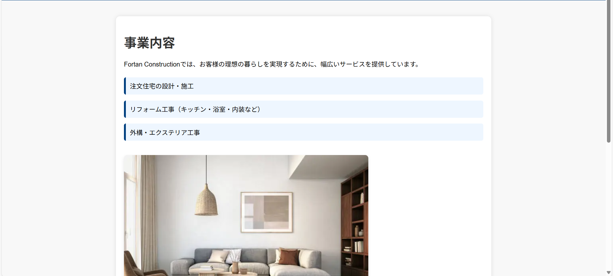
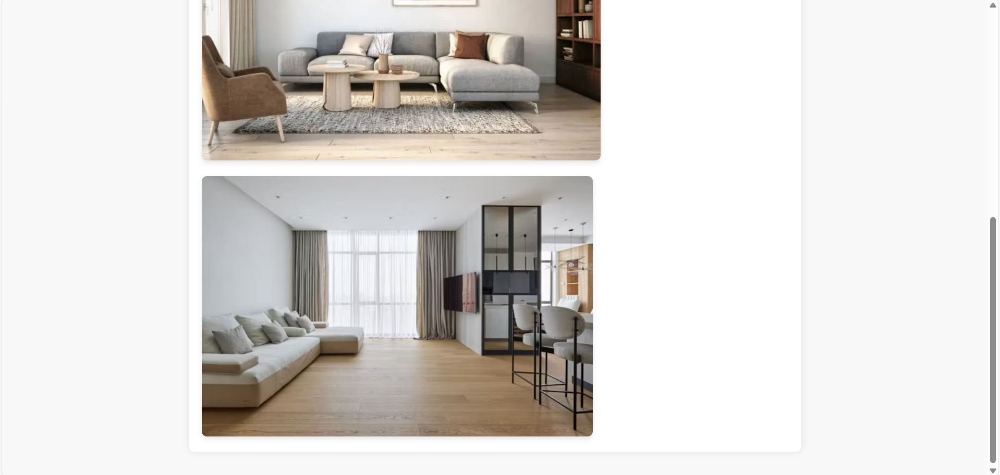
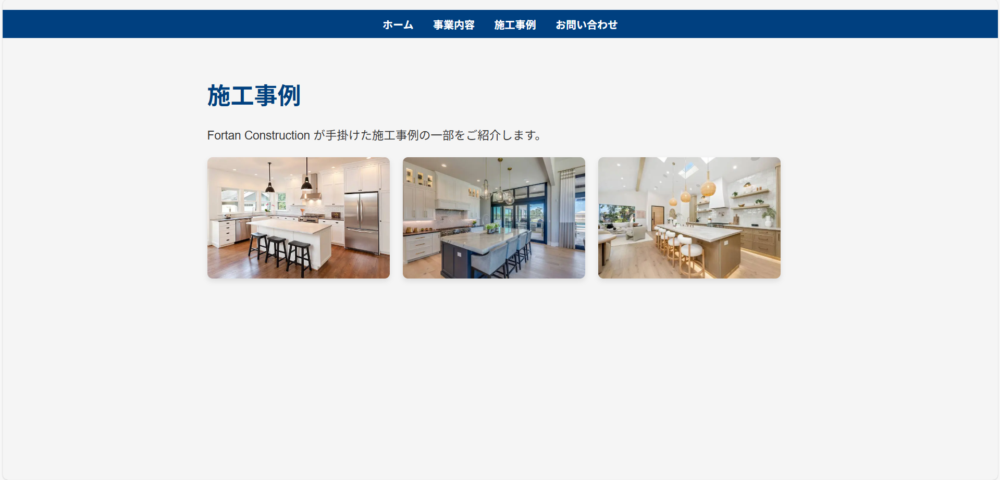
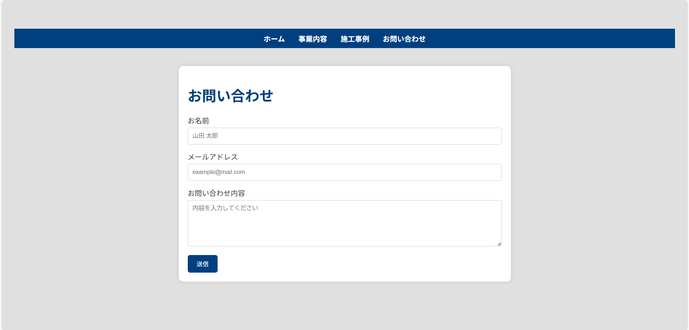
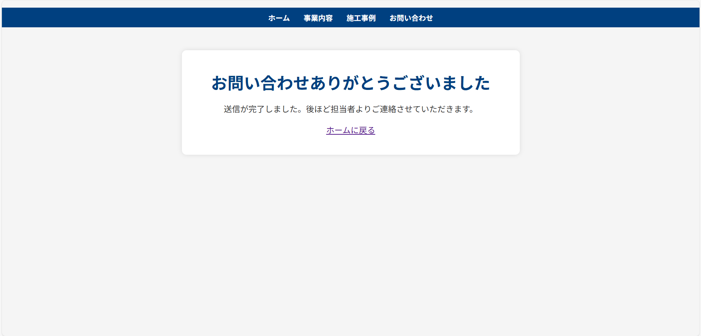

# 🏗️ Fortan Construction - Web制作ポートフォリオ

架空の建設会社「Fortan Construction」の公式Webサイトを制作しました。  
**HTML/CSSコーディング・フォーム連携・GitHub Pages公開**までを経験した学習成果の作品です。

---

## 🔗 公開URL（デモ）

[サイトを見る](https://hiromasa20071129-commits.github.io/company-site/)

---

## 📸 サイトスクリーンショット

📸 サイトスクリーンショット

---

## 💡 特徴・成果

- HTML/CSSで全ページをコーディング
- Formspreeを使ったお問い合わせフォーム実装
- GitHub Pagesでの公開（無料ホスティング）
- レスポンシブ対応でスマホでも見やすい
- デザイン統一（カラー・フォント・余白）によるプロ仕様UI

---

## 🛠 技術スタック

| 技術 | 詳細 |
|------|------|
| HTML/CSS | ページ全体コーディング |
| Formspree | お問い合わせフォーム連携 |
| GitHub Pages | サイト公開・ホスティング |
| Git | バージョン管理 |

---

## 🚀 学習プロセス・課題解決

- Formspree無料プランのリダイレクト制限 → 送信完了メッセージで代替
- 公開直後のキャッシュ問題 → 再デプロイとキャッシュクリアで解決
- デザイン統一とレイアウト調整で視覚的に整ったサイトに

---

## 📈 今後の拡張予定

- JavaScriptによるUI改善（アニメーション・動的コンテンツ）
- SCSS導入によるCSS整理
- SEO・OGP設定追加
- 実案件向けにカスタマイズ可能なテンプレート化

---

## 👤 作者について

**須藤 寛正（Hiromasa Sudo）**  
高校生Webクリエイター。  
建築とWebを両立させ、ポートフォリオ・実案件でスキルを伸ばすことを目標に制作中。

> 「現場を支える建築と、魅力を伝えるWebをひとつに。」

---

## 📝 ライセンス

学習・ポートフォリオ用プロジェクトです。商用利用は想定していません。  
画像・素材の著作権はそれぞれの提供元に帰属します。

© 2025 Fortan Construction (Student Project by Hiromasa Sudo)
